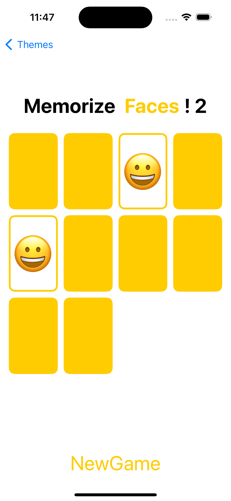
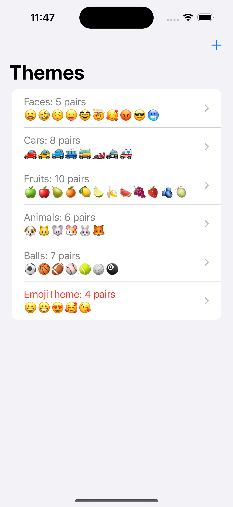
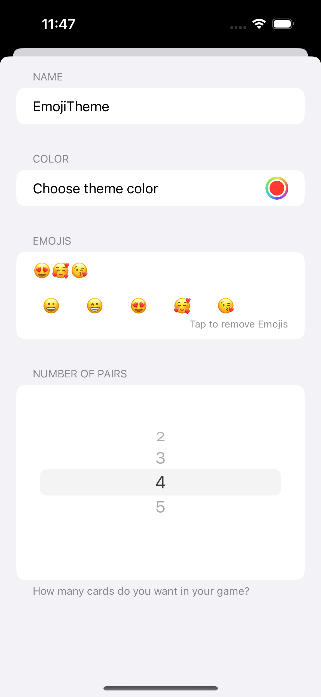

# Memorize

Memorize is a **card-matching game** built using **SwiftUI**. The goal is to find cards with matching faces. The game includes multiple themed sets of cards, and users can customize them by adding or deleting sets.

## 📌 Features
- 🃏 **Card Matching Gameplay** – Find pairs of matching cards.
- 🎨 **Multiple Themes** – Play with different sets of cards, each with a unique theme.
- ⚙️ **Customization** – Users can create new card sets or delete existing ones.
- 💾 **Persistence** – Custom sets are saved for future sessions.

## 🛠 Technologies Used
- **SwiftUI** – Declarative UI framework for iOS development.
- **MVVM Architecture** – Separation of concerns for maintainable and scalable code.
- **UserDefaults** – Persistent storage for user-created card sets.

---

This project was built as part of the **Stanford CS193p course** while learning SwiftUI development.

## 📱 Screenshots

